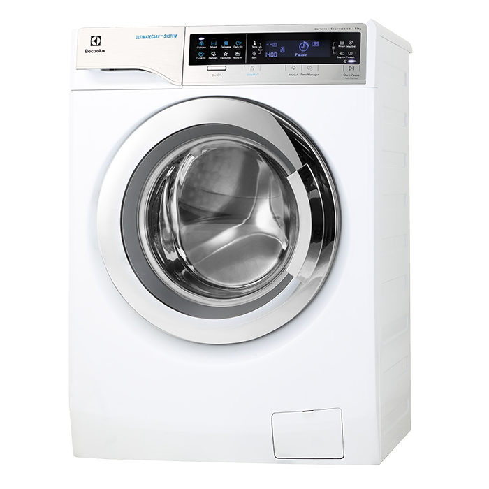
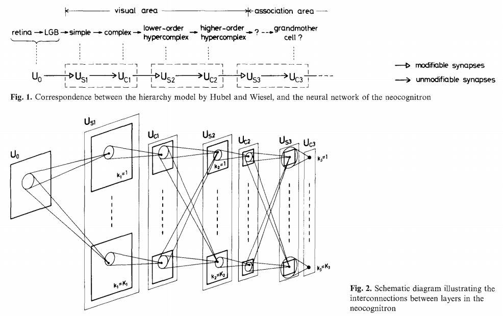
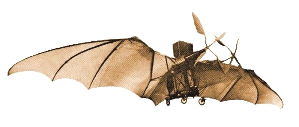

class: middle, center, title-slide
count: false

# L'Intelligence artificielle pour une médecine plus humaine

Journée du Président de la SRBGE.

11 mai 2019

  
Prof. Gilles Louppe 
[g.louppe@uliege.be](g.louppe@uliege.be)

---

class: black-slide, center

.width-90[]

Ma nuit aux urgences...

???

- Nuit du samedi au dimanche: frissons, température, maux de tete, toux.
- Etat grippal: Je passe ma journée du dimanche cloué au lit.
- Dimanche soir: Laura rentre et commence à s'inquiéter. On arrive aux urgences, il est 23h00.
- Protocole classique:
    - accueil
    - salle d'attente 1, radio thorax
    - salle d'attente 2, box urgence, parmi des urgences bondées
    - attente
    - premier examen par un interne, examen rapide et succint
    - attente
    - second examen par le médecin en charge?, examen rapide et succinct également
    - attente
    - attente
    - attente
    - il va etre 2h du matin
    - retour du médecin, mon taux de CRP est stratosphérique malgré un état grippal apparemment classique
    - attente
    - vous pouvez rentrer chez vous, voici une prescription pour des anti-biotiques
        je trouve ca un peu étrange et j'aurais sans doute aimé des explications, mais ok
    - aucun shot sur place!
- pour une personne si compétente, passer si longtemps à remplir de la paperasse, c'est quand meme dommage
- au détriment du temps patient finalement assez court

---

class: middle
count: false

# Intelligence artificielle?

---

class: middle, center

.width-70[]

"With artificial intelligence we are summoning the demon" -- Elon Musk

???

Vision alarmiste de l'IA dans l'actualité.

Imaginaire de science-fiction alimenté par le cinéma.

---

class: middle, center

.width-60[]

"We're really closer to a smart washing machine than Terminator" -- Fei-Fei Li, Director of Stanford AI Lab.

???

Plusieurs approches vers l'IA.

Aujourd'hui nous allons couvrir l'une d'entre elles dans le but de construire un programme qui serait capable de voir.

Les réseaux de neurones artificiels et l'apprentissage profond sont à l'origine de la majorité des derniers succès dont vous avez peut-etre entendu parler dans l'actualité.

---

class: middle, center

.width-80[]

Que voyez-vous?

???

Comment faites-vous cela ?!

---

class: middle

Comment *écrire un programme* informatique, capable de **voir** et de **comprendre**?

???

Exemples:
- reconnaissance -> appareil photo focus automatique

---

class: middle
.grid.center[
.kol-2-5[ .center.width-100[]]
.kol-2-5[
.width-100.center[]

.width-100.center[]
]
.kol-1-5[.width-100.circle[].width-100.circle[]]
]
 

## Perception visuelle (Hubel et Wiesel, 1959-1962)

David Hubel et Torsten Wiesel découvrent la base neuronale responsable de la **perception visuelle**.
Prix Nobel de médecine en 1981.

---

class: middle, black-slide

.center[

<iframe width="640" height="480" src="https://www.youtube.com/embed/y_l4kQ5wjiw?&loop=1&start=96" frameborder="0" volume="0" allowfullscreen></iframe>

]

.center[Hubel and Wiesel]

???

During their recordings, they noticed a few interesting things:
1. the neurons fired only when the line was in a particular place on the retina,
2. the activity of these neurons changed depending on the orientation of the line, and
3. sometimes the neurons fired only when the line was moving in a particular direction.

---

class: middle, center, black-slide

.grid[
.kol-1-2[.width-100[]]
.kol-1-2[  .width-100[]]
]

The Mark I Percetron (Frank Rosenblatt, 1959).

---

class: middle

## Neocognitron (Fukushima, 1980)

.center.width-90[]

Fukushima propose une implémentation par **réseau de neurones artificiels** du modèle hierarchique du système perceptuel de Hubel and Wiesel.

.footnote[Credits: Kunihiko Fukushima, [Neocognitron: A Self-organizing Neural Network Model](https://www.rctn.org/bruno/public/papers/Fukushima1980.pdf), 1980.]

???

Les patterns à détecter sont appris, et non hardcodés comme pour le perceptron.

---

class: middle

.center.width-90[]

.center[Inspiration biologique? Pas nécessairement une bonne idée!]

???

- Clément Ader **calque** la construction de l'Eole sur l'anatomie des chauve-souris.
- Elle s'envola le 9 octobre 1890 (13 années avant les frères Wright).
- ... mais vous n'en avez certainement jamais entendu parler!

---

class: middle

.grid[
.kol-2-5.center[.width-100[]]
.kol-3-5[

       

$$\neq \sigma \left(\sum w\_i x\_i \right)$$

]
]

---

class: middle

## Deep Learning (2012-Present)

.center.width-100[]

---

class: middle

## Que peut faire une IA aujourd'hui?

- Faire une traduction instantanée du Chinois vers l'Anglais?
- Répondre à un QCM, aussi bien qu'un enfant de 8 ans?
- Avoir une conversation pendant une heure?
- Jouer aux échecs? au jeu de Go? au Poker? au football?
- Faire les course, sur le web? dans un supermarché?
- Démontrer des théorèmes?
- Conduire une voiture, sur un parking? sur l'autoroute? dans le centre de Liège?
- Accomplir des actes chirurgicaux?
- Identifier des mélanomes, mieux que votre dermatologue?
- Ecrire une blague?
- Peindre comme Van Gogh? Composer une musique?

---

class: middle, center, black-slide

<iframe width="600" height="450" src="https://www.youtube.com/embed/qWl9idsCuLQ" frameborder="0" allowfullscreen></iframe>

Segmentation (Hengshuang et al, 2017)

---

class: middle, center, black-slide
count: false

<iframe width="600" height="450" src="https://www.youtube.com/embed/pW6nZXeWlGM" frameborder="0" allowfullscreen></iframe>

Pose estimation (Cao et al, 2017)

---

class: middle, center, black-slide
count: false

<iframe width="600" height="450" src="https://www.youtube.com/embed/-96BEoXJMs0" frameborder="0" allowfullscreen></iframe>

Driving a car (2016)

---

class: middle, center, black-slide
count: false

<iframe width="600" height="450" src="https://www.youtube.com/embed/yyLa6xIK9Qs" frameborder="0" allowfullscreen></iframe>

Playing soccer (2018)

---

class: middle, center, black-slide
count: false

<iframe width="600" height="450" src="https://www.youtube.com/embed/V1eYniJ0Rnk" frameborder="0" allowfullscreen></iframe>

Playing Atari games

---

class: middle, center, black-slide
count: false

<iframe width="600" height="450" src="https://www.youtube.com/embed/gn4nRCC9TwQ" frameborder="0" allowfullscreen></iframe>

Learning to walk (2017)

---

class: middle, center, black-slide
count: false

<iframe width="600" height="450" src="https://www.youtube.com/embed/7gh6_U7Nfjs" frameborder="0" allowfullscreen></iframe>

Speech synthesis and question answering (Google, 2018)

---

class: middle, center, black-slide
count: false

<iframe width="600" height="450" src="https://www.youtube.com/embed/kSLJriaOumA" frameborder="0" allowfullscreen></iframe>

Image generation (Karras et al, 2018)

---

class: middle, center, black-slide
count: false

<iframe width="600" height="450" src="https://www.youtube.com/embed/p5U4NgVGAwg" frameborder="0" allowfullscreen></iframe>

Changing sketches into photorealistic masterpieces (NVIDIA)

---

class: middle, center, black-slide
count: false

<iframe width="600" height="450" src="https://www.youtube.com/embed/egJ0PTKQp4U?start=223" frameborder="0" allowfullscreen></iframe>

Music composition (NVIDIA, 2017)

---

class: middle
count: false

# L'IA pour une médecine plus humaine

---

class: middle

## La fin du médecin?

- “Google’s AI beats doctors at spotting eye disease in scans”
https://www.ft.com/content/3de44984-9ef0-11e8-85da-eeb7a9ce36e4
- “Chinese AI beats 15 doctors in tumor diagnosis competition”
https://thenextweb.com/science/2018/07/02/chinese-ai-beats-15-doctors-in-tumor-diagnosis-competition/
- “AI beats doctors at predicting heart disease deaths”
https://www.thehindu.com/sci-tech/ai-beats-doctors-at-predicting-heart-disease-deaths/article24872914.ece
- “This AI Just Beat Human Doctors On A Clinical Exam”
https://www.forbes.com/sites/parmyolson/2018/06/28/ai-doctors-exam-babylon-health/
- “AI In Medicine: Rise Of The Machines”
https://www.forbes.com/sites/paulhsieh/2017/04/30/ai-in-medicine-rise-of-the-machines/

---

class: middle, black-slide

.center.width-80[]

.footnote[Credits: Photo by Aditya Romansa on Unsplash.]

---

class: middle

## Top 10 AI applications for healthcare

.center.width-90[]

.footnote[Credits: Accenture, [Artificial Intelligence: Healthcare’s New Nervous System](https://www.accenture.com/us-en/insight-artificial-intelligence-healthcare), 2018.]

???

diminuner le temps non-patient

rendre du temps au médecin pour le patient

---

class: middle

## Conclusions

- L'intelligence articielle est sur le point de révolutionner de nombreux domaines, *y compris la santé*.
- Les médecins ne vont pas être remplacés par des robots.
- En revanche, l'IA a le potentiel de **libérer du temps patient** via notamment
    - la réduction des visites inutiles par un pré-diagnostique accéléré,
    - la réduction du temps des activités administratives.

---

class: end-slide, center
count: false

Fin.
